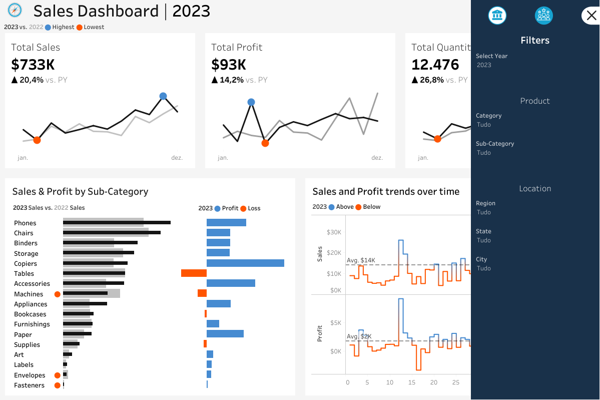

# [Sales Dashboard](https://public.tableau.com/app/profile/jo.o.baldacim/viz/SalesDashboard_17204522848230/SalesDashboard)

This is a dashboard that shows sales and customers info in two different tabs. Non-KPI charts can be used as filters.

## Sales
### KPI
Total sales, profit and quantity for current and previous year with monthly trends, highlighting highest and lowest months.

### Sales and Profit by Subcategory
Comparing sales performance for current and previous year per subcategory, with an indicator for where current year sales are less than previous year sales.

Also shows profit or loss by subcategory for current year.

### Sales and Profit trends over time
Presents weekly sales and profit compared to average.

## Customer
### KPI
Total customers, sales per customer and orders for current and previous year with monthly trends, highlighting highest and lowest months.

### Customer Distribution by Number of Orders
Shows the amount of customers based on the number of orders placed.

### Top 10 Customers by Profit
Table for the top 10 customers by profit. Contains ranking, customer name, date of last order placed, profit and sales for current year and number of orders.

## Filters

Users are able to filter by year, category, subcategory, region, state and city.

